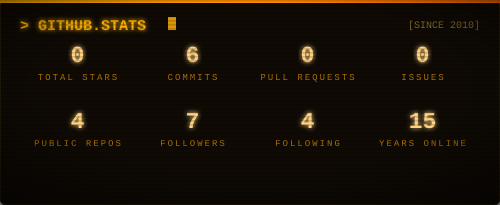
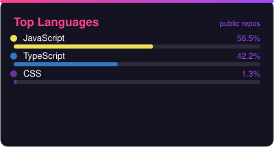
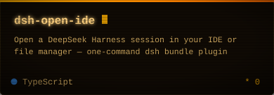
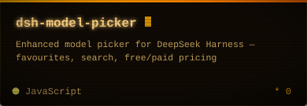
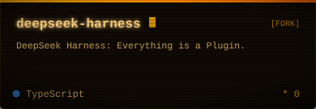

<!-- Waving banner -->

<!-- Typing intro -->

<!-- Social links -->

 
 

> *Data Wizard by Default, Coding Enthusiast by Choice — juggling enterprise applications at **Ibudata**, based in Putrajaya, Malaysia 🇲🇾*

### 🛠️ Tech Stack

 

### 📊 GitHub Stats

 

 

📈 Stats cards are generated from live GitHub data and refresh daily via GitHub Actions

### 🚀 Featured Projects

 

 
 

### ✨ Thanks for stopping by!

